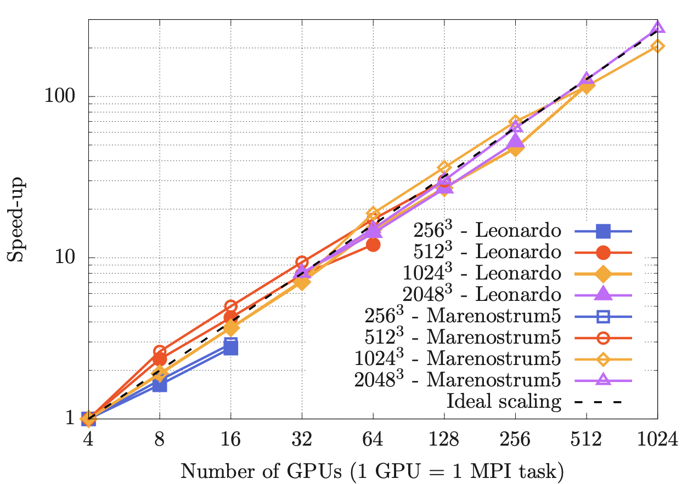
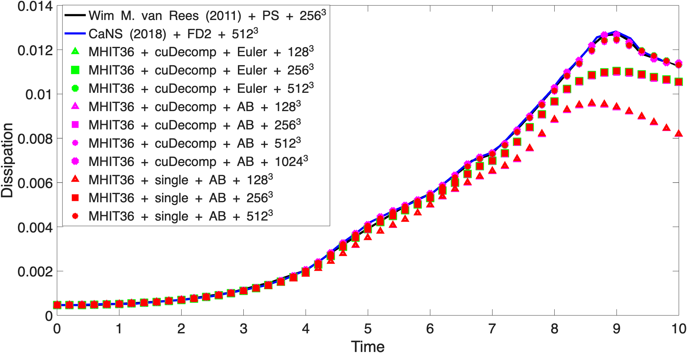

# MHIT36_cuDecomp

~~~text
███    ███ ██   ██ ██ ████████ ██████   ██████           ██████ ██    ██ ██████  ███████  ██████  ██████  ███    ███ ██████  
████  ████ ██   ██ ██    ██         ██ ██               ██      ██    ██ ██   ██ ██      ██      ██    ██ ████  ████ ██   ██ 
██ ████ ██ ███████ ██    ██     █████  ███████    +     ██      ██    ██ ██   ██ █████   ██      ██    ██ ██ ████ ██ ██████  
██  ██  ██ ██   ██ ██    ██         ██ ██    ██         ██      ██    ██ ██   ██ ██      ██      ██    ██ ██  ██  ██ ██      
██      ██ ██   ██ ██    ██    ██████   ██████           ██████  ██████  ██████  ███████  ██████  ██████  ██      ██ ██      
~~~

Tentative porting of MHIT36 to multi GPU using cuDecomp.

Log of changes/status of the porting
- 06/02/25: MPI init in MHIT36 
- 07/02/25: Build of cuDecomp ok, present in cuDecomp-main/Build
- 11/02/25: Up to cuFFT plan, adding comments step by step 
- 12/02/25: Compile and run on Leonardo + makefile for Leo
- 13/02/25: Adaption to work with only one grid descriptor and pencils along y and z only (0,1,1). Everyhing seems fine
- 14/02/25: Pencil update on y and z look also fine and working, all basic elements seems to be ready. cuDecomp updated to (#52), version 0.4.2, Tested on Leonardo up to 16 nodes (with the makefile with -cuda + -Wl, relax). The makefile issue is present only on Leonardo where cuda is not present in the same folder.
- 15/02/25: General structure of the code inializated and division in substeps, rhsp and p as input and output for Poisson.
- 17/02/25: Cleaning and use of module.f90 and readinput.f90, more variable included in the modules. Temporal loop created. Soon merging with main repository?
- 18/02/25: Fixed issue on makefile and forced linking (working also in Leonardo), flow field initialization looks of for different PR and PC; MPI output in parallel; tested different grid resolutions (up to 1024^3).
- 19/02/25: Phase-field initialization and MPI I/O of phase variables seem fine. Implementation of the projection step (convective, diffusive and forcing); halo updates of ustar, vstar and wstar also implemented. Issue with 1536^3 and 2048^3 on 8 nodes (32 GPUs).
poisson.f90 has the same issue (which is the one provided by Nvidia).
- 20/02/25: Problem on large grid (1536^3 and 2048^3) has been fixed (Thank you Josh), there was an integer overflow in the normalization; projection step implemented; first run on Local machine of the full NS solver. Still something off in the solver; blows up after a few iterations.
Strange behaviof of the convective terms, introduced internal update if pr=1 or pc=1. Now using dx=lx/(nx-1) the convective terms are fine.
- 21/02/25: Problem in the pressure correction; code seems to be runnig fine, does not blow up; first run on milton done (looks good); start running on Leonardo for re_lambda=95. Special case update for halo already accounted by cuDecomp (pc=1 and pr=1); these parts have been removed.
- 22/02/25: Add read input in parallel (to be tested)
- 24/02/25: Some issue with 25.1; revert back to 24.3 (works fine on both Leonardo and Local)
- 25/02/25: Improvement of Poisson solver (removed one block when copy in the rhsp); performance looks promising. Stop working on the code; perform full validation and scaling of this version; consider moving from EE to AB2; Leo in manteinance, wait tomorrow for some tests.
- 26/02/25: Everyhting looks good; testing using the WMR benchmark. cuDecomp and single GPU version match very well; AB2 vs Euler minor differences. Added post-processing folder to compute dissipation. TG test seems very good, agreement with CaNS and other results. Time integration modified to AB2, test looks good.
- 27/02/25: Strong scaling tests on Leonardo, nice scaling even for very small grids and using gpu managed memory.
- 28/02/25: Finalized validation with the TG benchmark, eveything looks good, try 1024^3? scaling also good, try 4096^3 avoid output (540 GB x file)
- 03/03/25: Working on an imporved Poisson solver on aroccon/cuDecomp git repository. Computational time seems much better (especially on large grids, almost 2X speed-up). Still something is off, double check in e out from the Poisson to see if in/out is different or is the solver.
- 04/03/25: Updated results with 1024^3 for the same benchmark.

# Multi-GPU version status

- Poisson solver (transposition + halo update) ✅
- Poisson solver validation (periodic solutions) ✅
- Read input files ✅
- Skeleton of the code  ✅
- Halo updates test with CUDA ✅
- Poisson solver scaling ✅
- Halo updates test with host_data use_device ✅
- Flow field initialization ✅
- Phase-field initialization ✅
- Projection step implemented ✅
- Validation of projection step ✅ (implemented, not validated)
- Correction step ✅ (implemented, not validated)
- Forcing ✅
- HIT validation ❌
- Drop oscillation validation ❌
- Full code scaling ✅
- MPI writing (no halo)  ✅
- MPI reading (no halo) (to be tested)
- Serial reading (to avoid issue with Leonardo) ❌
- Courant number check (MPI reduction) ✅ !only from rank 0? enough?
- MPI I/O with different configurations (color by rank), exstensive check fo this part. ❌
- Move from Euler to AB2 as in MHIT36  ✅
- Acceleration of some parts (not done at the moment to debug the solver) ✅
- Check divergence of the fields ✅

# Run the code

- Compile first the cuDecomp library using *_lib.sh, the resulting modules and library will be located in cuDecomp/build/lib and cuDecomp/build/include
- Double check cuDecomp building is fine (must be compiled using HPC-SDK)
- Single folder: contains the single GPU version of the code (see MHIT36 repository for further details), no MPI required.
- Multi folder: multi GPU version of the code (work in progress). Use local.sh or leo.sh to compile and run the code (see porting status above); the multi GPU version relies on cuDecomp for Pencil Transposition and halo exchanges.
- Autotuning of the multi-GPU version: leave pr=0 and pc=0, cuDecomp will perform an autotuning at the start finding the best decomposition (the only input is the total number of tasks). Everything should be automatic in the code (as it is obtained from cuDecomp variable)

# Reference performance

Performance (NS only)
* 128 x 128 x 128 | 2 x RTX5000@milton |   14 ms/timestep
* 256 x 256 x 256 | 2 x RTX5000@milton |  129 ms/timestep
* 128 x 128 x 128 | 4 x A100@Leonardo  |    7 ms/timestep
* 256 x 256 x 256 | 4 x A100@Leonardo  |   44 ms/timestep
* 512 x 512 x 512 | 4 x A100@Leonardo  |  470 ms/timestep
* 512 x 512 x 512 | 8 x A100@Leonardo  |  200 ms/timestep
* 512 x 512 x 512 | 8 x A100@Leonardo  |  200 ms/timestep
* 1024 x 1024 x 1024 | 64 x A100@Leonardo | 272 ms/timestep
* 2048 x 2048 x 2048 | 256 x A100@Leonardo | 740 ms/timestep

Max resolution tested (Poisson only):
*  768 x  768 x  768 | 2 x RTX5000@milton - 16 GB VRAM
* 2048 x 2048 x 2048 | 32 x A100@Leonardo - 64 GB VRAm (also tested on 128/256 GPUs)

# Scaling

Strong scaling results obtained on Leonardo (4 x A100 64 GB x node)
* Tested from 1 node up to 64 nodes
* Grid from 64 x 64 x 64 up to 2048 x 2048 x 2048

# Validation

Benchamrk present in "W.M.VanRees,A.Leonard,D.Pullin,P.Koumoutsakos,Acomparisonofvortexandpseudo-spectralmethodsforthesimulationofperiodicvortical
flowsathighReynoldsnumbers,J.Comput.Phys.230(8)(2011)2794–2805" and also Used in CaNS.

Time evolution of the viscous dissipation:

