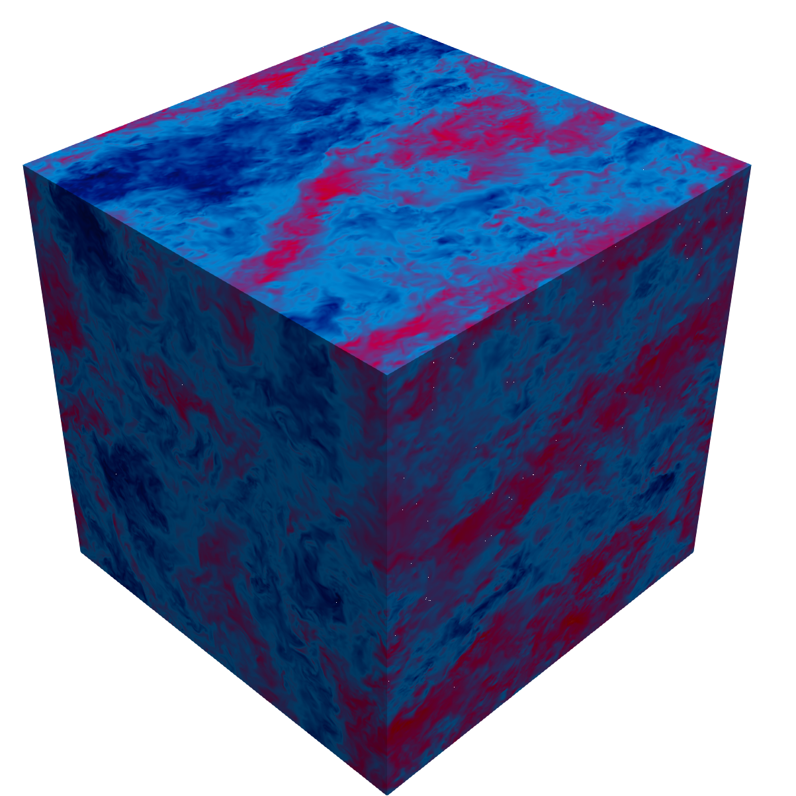

# Homogeneous isotropic turbulence box configuratuion

Code for DNS of turbulence in homogeneous isotropic turbulence.
Solution of Navier-Stokes equations + phase-field method (ACDI).
For time integration, a fully explicit scheme is used: Euler explicit for ACDI + AB2 for Navier-Stokes.

## Check list of features implemented
- Uniform grid along all three directions 
- Poisson solver based on full 3D FFT 
- Domain size: 2*pi along all three directions

**Autotuning of decomposition**  
- Default: `pr=0` and `pc=0` → enables **automatic process decomposition**.  
- Only input needed: **total number of MPI tasks**.  
- No recompilation required when changing MPI processes.  

**Optional features (conditional compilation)**  
- Phase-field module: Can be enabled or disabled. Default is single-phase.  
- Particles (tracers): Can be enabled or disabled. Default is single-phase.  
 
## Homogeneous isotropic turbulence box 
- HIT at Re_lambda=200, Grid: 512 x 512 x 512

## Nodes numbering and staggered grid

X-pencil configuration:

## Contributing

We welcome all contributions that can enhance TCF36, including bug fixes, performance improvements, and new features. 
If you would like to contribute, please contact me or open an Issue in the repository.